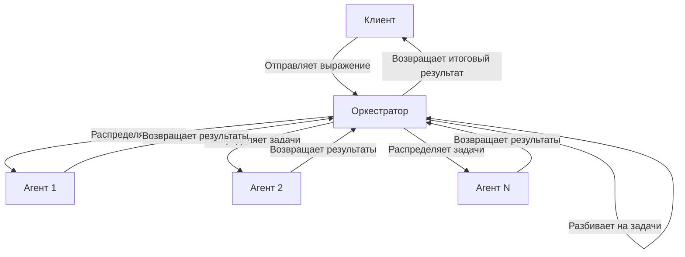
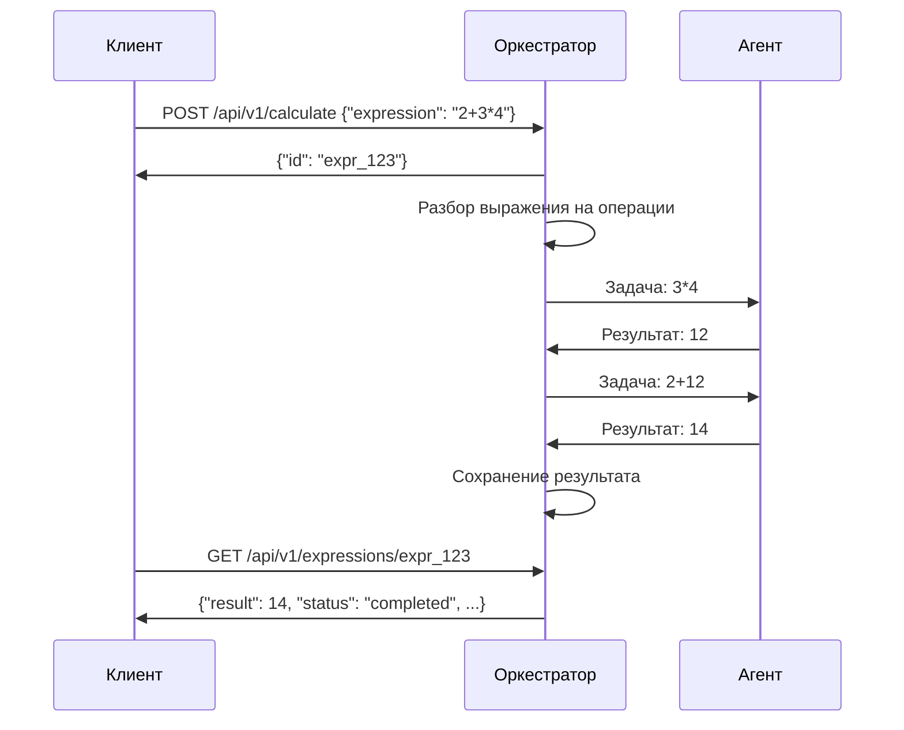

## Распределённый вычислитель арифметических выражений
- [Обзор системы](#обзор-системы)
- [Архитектура](#архитектура)
- [Установка и запуск](#установка-и-запуск)
  - [Запуск с помощью Docker Compose](#запуск-с-помощью-docker-compose)
  - [Запуск с помощью Makefile](#запуск-с-помощью-makefile)
  - [Ручная сборка и запуск](#ручная-сборка-и-запуск)
- [Использование API](#использование-api)
  - [Отправка выражения на вычисление](#отправка-выражения-на-вычисление)
  - [Получение списка выражений](#получение-списка-выражений)
  - [Получение результата конкретного выражения](#получение-результата-конкретного-выражения)
- [Конфигурация](#конфигурация)
  - [Оркестратор](#оркестратор)
  - [Агент](#агент)
- [Масштабирование](#масштабирование)

## Обзор системы

Система состоит из двух основных компонентов:

1. **Оркестратор** - центральный сервер, который принимает математические выражения, разбивает их на элементарные операции и распределяет задачи между агентами.
2. **Агенты** - рабочие узлы, которые выполняют элементарные математические операции и возвращают результаты оркестратору.

Система поддерживает базовые математические операции: сложение, вычитание, умножение и деление.

## Архитектура



### Процесс вычисления:

- Клиент отправляет математическое выражение оркестратору.
- Оркестратор разбивает выражение на элементарные операции.
- Агенты получают операции и возвращают результаты оркестратору.
- Оркестратор собирает результаты и вычисляет итоговый ответ.
- Клиент может запросить результат вычисления.

## Установка и запуск

### Запуск с помощью Docker Compose

Самый простой способ запустить систему - использовать Docker Compose:

```bash
# Клонирование репозитория
git clone https://github.com/yourusername/distr-comp.git
cd distr-comp

# Запуск системы
docker-compose up -d

# Для запуска с большим количеством агентов
docker-compose up -d --scale agent=5
```

### Запуск с помощью Makefile

Если у вас установлен Go и Make, вы можете использовать Makefile:

```bash
# Клонирование репозитория
git clone https://github.com/yourusername/distr-comp.git
cd distr-comp

# Сборка проекта
make build

# Запуск оркестратора (в отдельном терминале)
./build/orchestrator

# Запуск агента (в отдельном терминале)
./build/agent
```

### Ручная сборка и запуск

```bash
# Клонирование репозитория
git clone https://github.com/yourusername/distr-comp.git
cd distr-comp

# Сборка оркестратора
go build -o build/orchestrator cmd/orchestrator/main.go

# Сборка агента
go build -o build/agent cmd/agent/main.go

# Запуск оркестратора (в отдельном терминале)
./build/orchestrator

# Запуск агента (в отдельном терминале)
./build/agent
```

## Использование API

### Отправка выражения на вычисление

```bash
curl -X POST http://localhost:8080/api/v1/calculate \
  -H "Content-Type: application/json" \
  -d '{"expression": "2 + 2 * 3"}'
```

**Ответ:**

```json
{
  "id ": "expr_12345"
}
```

### Получение списка выражений

```bash
curl -X GET http://localhost:8080/api/v1/expressions
```

**Ответ:**

```json
{
  "expressions": [
    {
      "id": "expr_12345",
      "status": "completed",
      "result": 8
    },
    {
      "id": "expr_67890",
      "status": "processing",
      "result": null
    }
  ]
}
```

### Получение результата конкретного выражения

```bash
curl -X GET http://localhost:8080/api/v1/expressions/expr_12345
```

**Ответ:**

```json
{
  "id": "expr_12345",
  "expression": "2 + 2 * 3",
  "status": "completed",
  "result": 8,
  "created_at": "2023-05-20T15:30:45Z",
  "completed_at": "2023-05-20T15:30:46Z"
}
```

## Конфигурация

### Оркестратор

Оркестратор настраивается через переменные окружения:

- `PORT` - Порт, на котором запускается оркестратор (по умолчанию 8080)
- `TIME_ADDITION` - Время выполнения операции сложения (мс)
- `TIME_SUBTRACTION` - Время выполнения операции вычитания (мс)
- `TIME_MULTIPLICATION` - Время выполнения операции умножения (мс)
- `TIME_DIVISION` - Время выполнения операции деления (мс)

**Пример:**

```bash
PORT=9090 TIME_ADDITION=1000 TIME_MULTIPLICATION=2000 ./build/orchestrator
```

### Агент

Агент настраивается через переменные окружения:

- `COMPUTING_POWER` - Количество параллельных вычислительных потоков
- `ORCHESTRATOR_URL` - URL оркестратора

**Пример:**

```bash
COMPUTING_POWER=20 ORCHESTRATOR_URL=http://orchestrator:8080 ./build/agent
```

## Масштабирование

Система поддерживает горизонтальное масштабирование путем добавления дополнительных агентов. Каждый агент автоматически регистрируется в оркестраторе и начинает получать задачи.

### Масштабирование с Docker Compose

```bash
# Увеличение количества агентов до 5
docker-compose up -d --scale agent=5
```

### Ручное масштабирование

Просто запустите дополнительные экземпляры агента:

```bash
# Запуск дополнительного агента
COMPUTING_POWER=15 ./build/agent
```

## Последовательность вычисления выражения


